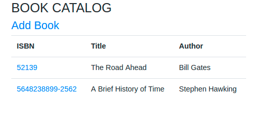

Small MERN app for a book-cataloging service with basic functionalities of adding / editing / deleting books to the catalog.

This app has been bootstrapped with [create-react-app](https://github.com/facebook/create-react-app)

To run this app:

First start mongodb service with ``sudo service mongod start`` and then the following commands

* Run `npm install`
* Run `npm run build`
* Run `npm start`

It will start the server at http://localhost:3000/

